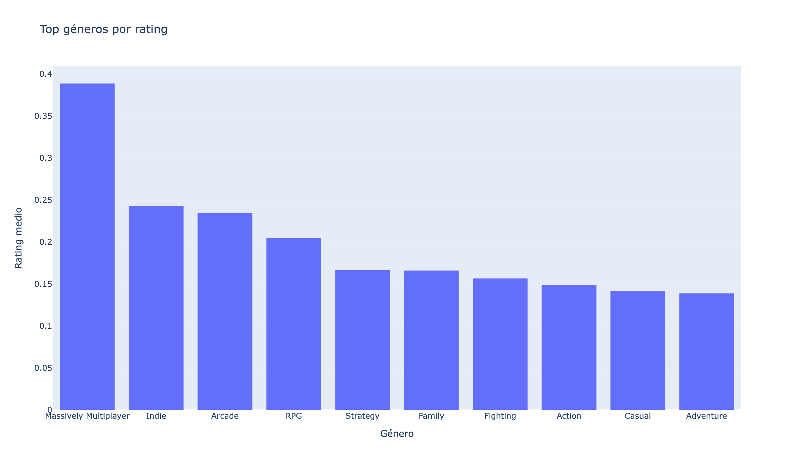
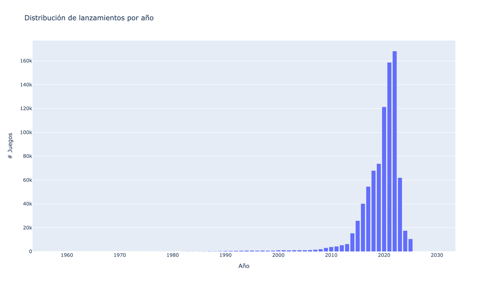
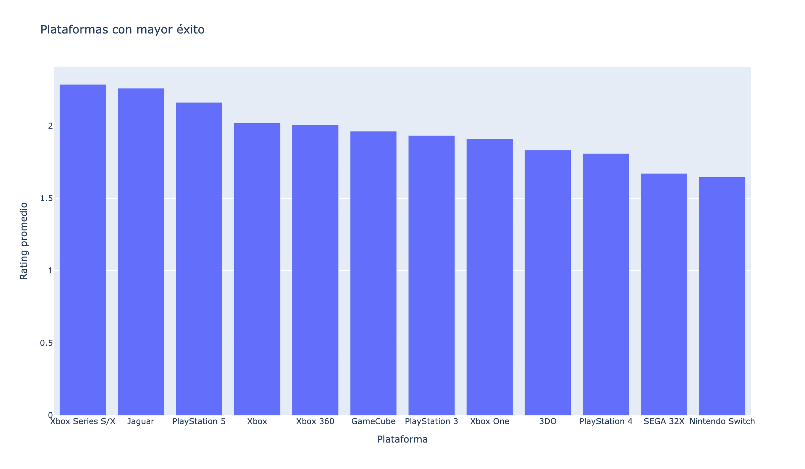
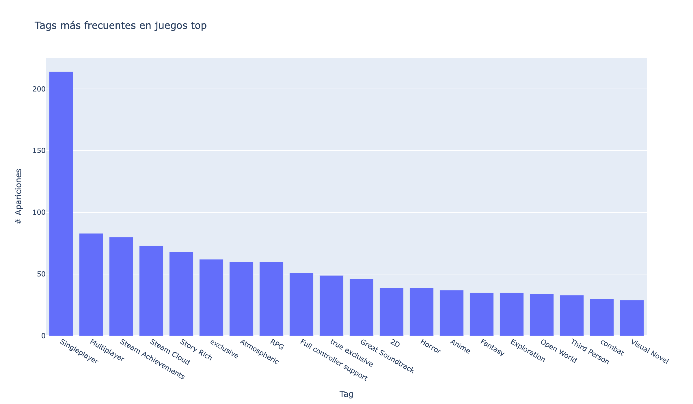
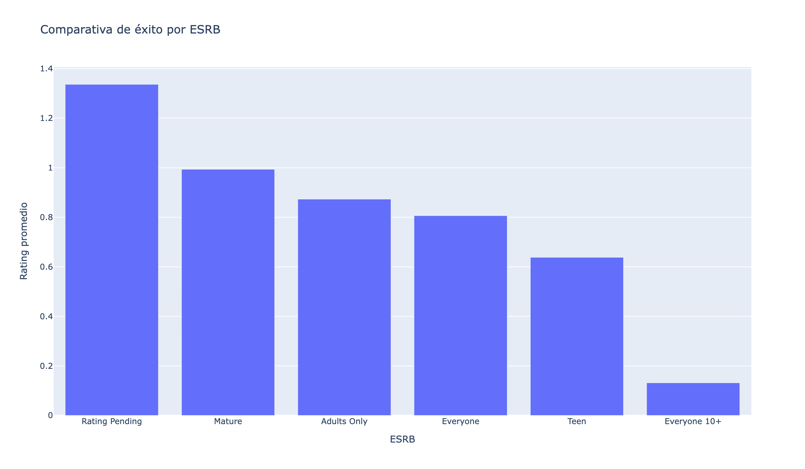

# Proyecto RAWG: Pipeline de Datos, Ciencia de Datos y API NL→SQL

[](https://www.python.org/)
[](https://fastapi.tiangolo.com/)
[](https://huggingface.co/transformers/)
[](https://aws.amazon.com/)
[](https://www.postgresql.org/)


Repositorio completo y listo para producción que cubre el ciclo de vida de datos con RAWG: ingesta escalable en AWS, definición de éxito de videojuegos, notebooks de modelado optimizados para Kaggle y una API FastAPI v5 que convierte lenguaje natural a SQL sobre una base de datos PostgreSQL con predicción de éxito de videojuegos.

Este repositorio está diseñado como carta de presentación profesional del equipo: código limpio, documentación sólida y despliegue reproducible.

---

## Índice

- [Visión General](#visión-general)
- [Arquitectura](#arquitectura)
- [Estructura del Repositorio](#estructura-del-repositorio)
- [Pipeline de Datos (AWS)](#pipeline-de-datos-aws)
- [Definición de Éxito y Ciencia de Datos](#definición-de-éxito-y-ciencia-de-datos)
- [API v5: NL→SQL y Predicción de Éxito](#api-v5-nlsql-y-predicción-de-éxito)
- [Ejecución Local](#ejecución-local)
- [Variables de entorno](#variables-de-entorno)
- [Visualizaciones destacadas](#visualizaciones-destacadas)
- [Despliegue en AWS EC2](#despliegue-en-aws-ec2)
- [Roadmap (alto nivel)](#roadmap-alto-nivel)
- [Contribución](#contribución)
- [Licencia](#licencia)
- [Contacto del Equipo](#contacto-del-equipo)

---

## Visión General

- __Objetivo__: permitir a diseñadores y analistas consultar y explorar el catálogo de videojuegos y métricas de éxito, además de servir predicciones de éxito pre-lanzamiento usando features de diseño (géneros, plataformas, tags, duración estimada).
- __Pilares__: pipeline de ingesta en AWS, definición cuantitativa de éxito, notebooks de análisis/modelado optimizados para Kaggle y una API NL→SQL con predicción de éxito.
- __Tecnologías__: AWS (S3, Lambda, RDS), PostgreSQL, FastAPI, Python, Transformers (T5 fine-tuned), Random Forest (Scikit-learn), Plotly, Pandas.

---

## Arquitectura

1. __Ingesta y almacenamiento__
   - Extracción masiva y diaria desde la API de RAWG (AWS Lambda + EventBridge) a `S3`.
   - Carga estructurada a `PostgreSQL` en `AWS RDS` mediante Lambda de loader.
2. __Capa de servicio__
   - API `FastAPI` v5 desplegada en `AWS EC2` con endpoints de NL→SQL, visualizaciones y predicción de éxito.
3. __Ciencia de datos__
   - Definición de métrica de éxito, notebooks de EDA/modelado optimizados para Kaggle y modelo Random Forest para predicción de éxito.

En `docs/` puedes ver el diagrama (`docs/arquitectura_aws.png`) y la documentación general (`docs/project_documentation.md`).


---

## Estructura del Repositorio

```text
.
├── api/                     # Código de la API
│   ├── api_v5/
│   │   ├── api_v5/
│   │   │   ├── main_v5.py   # App FastAPI principal (NL→SQL + predicción)
│   │   │   └── run_api_v5.py # Script de arranque local
│   │   └── data/model_v3/   # Modelo entrenado para predicción
├── data_pipeline/           # Código de extracción/carga (AWS Lambda, loader)
│   ├── loader/
│   └── rawg_extractor/
├── deployment/
│   └── api_deploy/          # Paquete de despliegue listo para EC2
│       ├── api_v5/          # API v5 empaquetada
│       ├── start_api.sh
│       ├── rawg-api.service
│       └── requirements.txt
├── docs/                    # Documentación (movida desde deployment)
│   └── EC2_DEPLOYMENT_GUIDE.md # Guía completa de despliegue
├── Notebooks/               # EDA y modelado (optimizados para Kaggle)
│   ├── model-training-rawg-games-v3.ipynb # Entrenamiento optimizado para Kaggle
│   ├── eda_rawg_games_v3.ipynb # EDA balanceado con dataset v3
│   ├── analisis_criterio_exito.ipynb
│   └── modelo_asktosql.ipynb
├── requirements.txt         # Dependencias de la API v3
└── README.md                # Este documento
```

Nota: Se omite intencionalmente el estudio del contenido de `data/` en este README.

---

## Pipeline de Datos (AWS)

- __Extracción masiva y diaria__: ver `docs/massive_extraction_rawg.md`, `docs/lambda_daily.md`.
- __Loader a RDS__: ver `docs/massive_loader.md` y `docs/explicacion_lambda_loader.md`.
- __Configuración AWS__: ver `docs/Lambda_RAWG_config_AWS.md`.

Resultados: datos crudos en S3 y tablas normalizadas/vistas en PostgreSQL (RDS) que consumen notebooks y API.

---

## Definición de Éxito y Ciencia de Datos

- __Definición de éxito__: `docs/success_score_definition.md`.
- __EDA y modelado__: notebooks en `Notebooks/`.
  - [`Notebooks/model-training-rawg-games-v3.ipynb`](Notebooks/model-training-rawg-games-v3.ipynb): entrenamiento optimizado para Kaggle con rutas auto-detectadas y gestión eficiente de recursos.
  - [`Notebooks/analisis_criterio_exito.ipynb`](Notebooks/analisis_criterio_exito.ipynb): análisis para validar la métrica de éxito y señales en features de diseño.
  - [`Notebooks/modelo_asktosql.ipynb`](Notebooks/modelo_asktosql.ipynb) / [`Notebooks/text2sql_exploration.ipynb`](Notebooks/text2sql_exploration.ipynb): experimentos NL→SQL.

Datasets y consideraciones adicionales se documentan en `docs/project_documentation.md`.

---

## API v5: NL→SQL y Predicción de Éxito

Código principal: `api/api_v5/api_v5/main_v5.py`.

- __Modelo__: `cssupport/t5-small-awesome-text-to-sql` (Transformers + SentencePiece).
- __Endpoints clave__:
  - `GET /` estado y metadatos de la API.
  - `POST /ask-text` consultas de texto a SQL.
  - `POST /ask-visual` NL→SQL + visualización automática (Plotly dict).
  - `POST /predict` predicción de éxito usando features de diseño (géneros, plataformas, tags, duración).
  - `GET /test-model` verificación de disponibilidad del modelo.
  - `POST /test-fast-query` consulta SQL rápida para diagnóstico.
  - `GET /docs` documentación interactiva Swagger.

Ejemplo de petición `ask-visual`:

```json
POST /ask-visual
{
  "question": "Top 10 géneros por número de juegos"
}
```

Respuesta (esquema):

```json
{
  "question": "...",
  "sql": "SELECT ...",
  "data": [ {"col1": 1, "col2": "x"} ],
  "visualization": { "data": [...], "layout": {...} },
  "metadata": {"execution_time_ms": 1234},
  "execution_time": 1.23,
  "success": true
}
```

Ejemplo de petición/respuesta `ask-text`:

```json
POST /ask-text
{
  "question": "What are the best action games?"
}

Respuesta
{
  "question": "What are the best action games?",
  "sql": "SELECT g.name, g.rating FROM games g JOIN game_genres gg ON g.id_game = gg.id_game JOIN genres gen ON gen.id_genre = gg.id_genre WHERE gen.name ILIKE '%Action%' ORDER BY g.rating DESC LIMIT 10;",
  "data": [
    {"name": "Grand Theft Auto V", "rating": 4.47},
    {"name": "The Witcher 3: Wild Hunt", "rating": 4.66}
  ],
  "metadata": {
    "model": "cssupport/t5-small-awesome-text-to-sql",
    "rows_returned": 10,
    "columns": ["name", "rating"]
  },
  "execution_time": 2.34,
  "success": true
}
```

### Errores y códigos HTTP

| Código | Caso común | Mensaje típico |
|-------:|------------|----------------|
| 400 | Entrada vacía o inválida | "La pregunta no puede estar vacía" |
| 422 | Validación JSON | Detalle de validación Pydantic |
| 500 | Error interno inesperado | "Error inesperado en ask_text/ask_visual" |

Validaciones incluidas: sanitización básica de entrada, manejo de errores y conversión segura de tipos (`numpy` → nativo) para JSON.

### Ejemplos rápidos

```bash
curl -X POST http://localhost:8000/ask-text \
  -H "Content-Type: application/json" \
  -d '{"question": "Top 5 games by rating"}'
```

```bash
curl -X POST http://localhost:8000/ask-visual \
  -H "Content-Type: application/json" \
  -d '{"question": "Distribution of games by year"}'
```

---

## Ejecución Local

1. __Requisitos__
   - Python 3.10+
   - `pip install -r requirements.txt`

2. __Variables de entorno__ (`.env` en la raíz)
   - Credenciales y cadena de conexión a PostgreSQL (RDS o local).
   - Claves o configuraciones necesarias para acceder a la base de datos RAWG derivada.

3. __Arranque de la API__
   - Opción A: `python api/api_v5/api_v5/run_api_v5.py`
   - Opción B: `uvicorn api.api_v5.api_v5.main_v5:app --reload --host 0.0.0.0 --port 8000`

Abrir `http://localhost:8000/docs` para probar.

---

## Variables de entorno

| Variable | Descripción | Por defecto |
|----------|-------------|-------------|
| `DB_HOST` | Host/PostgreSQL | — |
| `DB_PORT` | Puerto PostgreSQL | `5432` (si no se define) |
| `DB_NAME` | Base de datos | — |
| `DB_USER` | Usuario DB | — |
| `DB_PASS` | Password DB | — |
| `RAWG_API_KEY` | Clave de API RAWG (para extracción en `data_pipeline/`) | — |
| `S3_BUCKET` | Bucket de destino (pipeline) | — |
| `API_BASE_URL` | Base URL de la API | `http://localhost:8000` |

Sugerido: usar un archivo `.env` en la raíz y cargarlo antes de ejecutar. En el paquete de despliegue (`deployment/api_deploy/`) se incluye documentación y ejemplos de variables.

---

## Visualizaciones destacadas

Imágenes generadas por el equipo a partir de consultas SQL directas sobre PostgreSQL y embebidas para comunicar insights clave del dataset RAWG:

Nota: las imágenes versionadas se almacenan en `docs/visuals/` y se actualizan manualmente por el equipo.

- Top géneros por rating

  

- Distribución de lanzamientos por año

  

- Plataformas con mayor éxito

  

- Tags más frecuentes en juegos top

  

- Comparativa de éxito por ESRB

  

---

## Despliegue en AWS EC2

Paquete de despliegue listo en `deployment/api_deploy/` con:

- Guía completa en `docs/EC2_DEPLOYMENT_GUIDE.md`: firewall UFW, Fail2Ban, systemd service, rotación de logs, monitoreo y troubleshooting.
- Configuración de seguridad y optimizaciones para producción.

Sigue la guía paso a paso para una instancia EC2 (recomendado t3.medium) y valida los endpoints públicos.

---

## Buenas Prácticas y Calidad

- __Seguridad__: restricción de puertos, sanitización NL→SQL, servicio detrás de Nginx.
- __Observabilidad__: logs estructurados, pruebas de conectividad (`/test-model`, `/test-fast-query`).
- __Mantenibilidad__: módulos claros en `api/api_v5/api_v5/models/` y documentación completa.
- __ML en Producción__: modelo de predicción integrado con validación de entrada y manejo de errores.

---

## Roadmap (alto nivel)

- __API__: cache de resultados frecuentes, rate limiting, autenticación opcional.
- __Modelado__: mejora del modelo de predicción con redes neuronales; finetuning incremental NL→SQL con feedback.
- __Data__: nuevas fuentes complementarias y pipelines de calidad de datos.
- __Kaggle Integration__: notebooks optimizados para competencias y colaboración.

---

## Contribución

1. Crear rama feature.
2. Asegurar compatibilidad con `requirements.txt` y estilo consistente.
3. Actualizar documentación en `docs/` cuando aplique.
4. Abrir PR con descripción técnica y evidencias.

---

## Licencia

Pendiente de definir por el equipo. Añadir archivo `LICENSE` si aplica.

---

## Contacto del Equipo

| Nombre | Correo 📧 | LinkedIn 🔗 |
|-------|-----------|-------------|
|[Alex G. Herrera](mailto:alex_gh@live.com) | alex_gh@live.com | [LinkedIn](https://www.linkedin.com/in/alejandro-guerra-herrera-a86053115/) |
|[Ignacio Buhigas León](mailto:ignacio.buhigas@gmail.com) | ignacio.buhigas@gmail.com | [LinkedIn](https://www.linkedin.com/in/ignaciobuhigas/) |
|[Sorrow Grajales Rufián](mailto:sforsorrow@outlook.com)| sforsorrow@outlook.com | [LinkedIn](https://www.linkedin.com/in/sforsorrow) |
|[Alejandro Cambón Sánchez] | alexcambonsanchez@gmail.com | [LinkedIn](https://www.linkedin.com/in/alejandro-camb%C3%B3n-s%C3%A1nchez-5322342b8/) |
|[Nombre 5] | correo5@dominio.com | [LinkedIn](https://linkedin.com/in/usuario5) |
